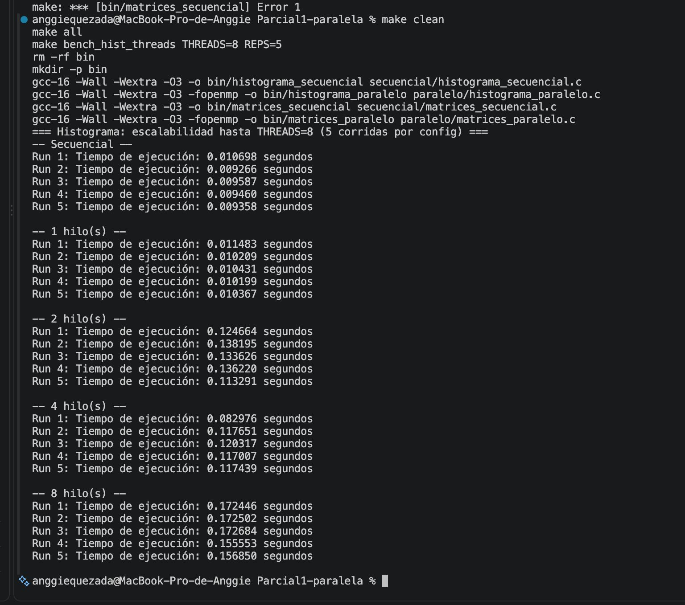
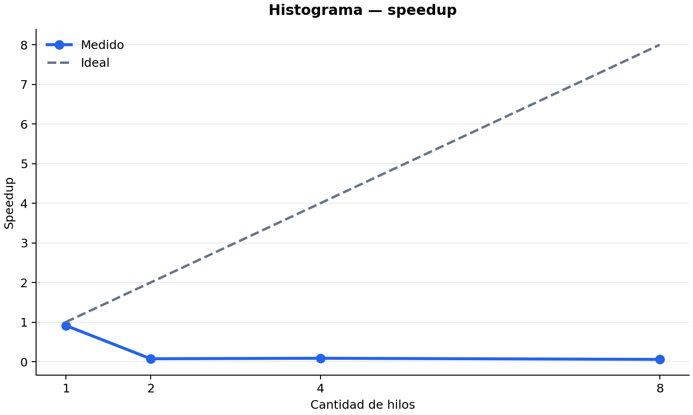
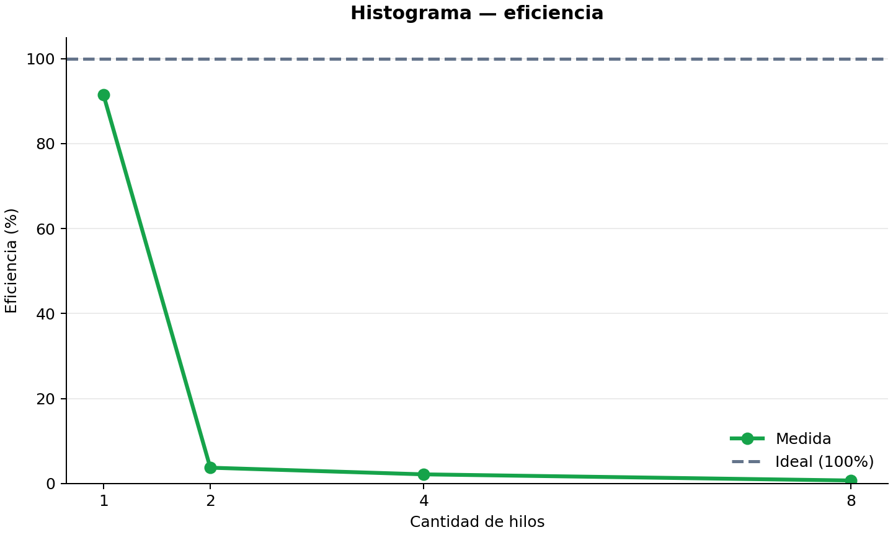
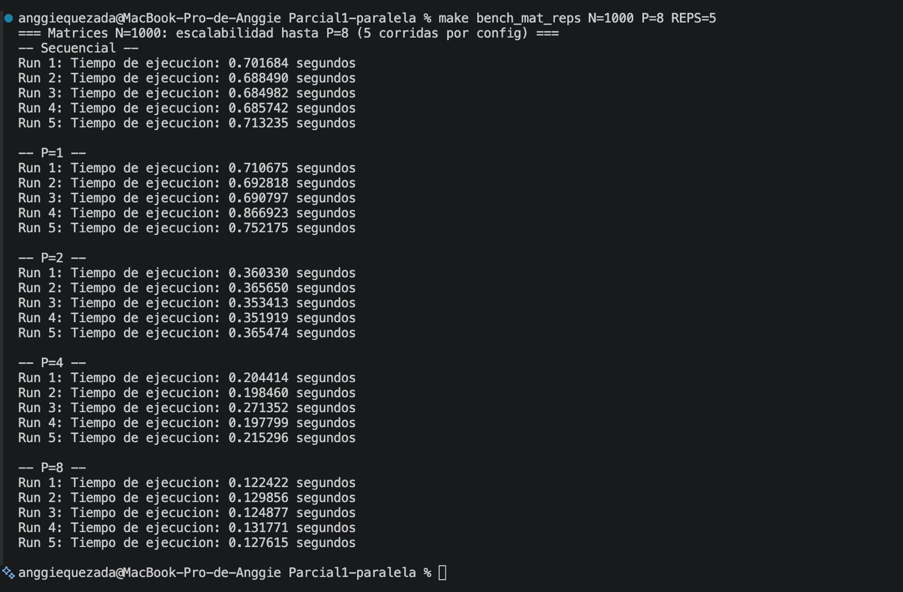
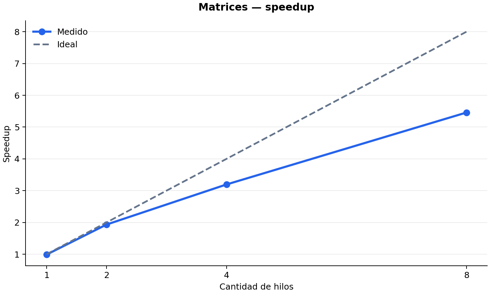
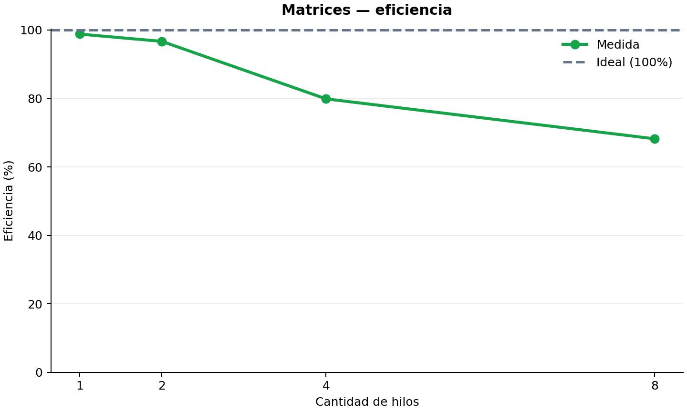

# Métricas de desempeño de Anggie Quezada

Fecha de pruebas 2026-09-11

Máquina MacBook Pro de Anggie

CPU Apple Silicon con 8 núcleos

Sistema operativo macOS

Compilador gcc-16 con `-O3 -fopenmp`

---

# Histograma

## Datos de prueba

- N de 10,000,000 elementos
- 100 bins
- Valores generados con `rand()` y semilla 42
- 5 corridas por cada configuración
- Hilos probados 1, 2, 4 y 8

## Resultados

| Configuración | Tiempo promedio en segundos | Desv. estándar | Speedup | Eficiencia |
|---|---:|---:|---:|---:|
| Secuencial | 0.009674 | 0.000585 | Base | Base |
| Paralelo P=1 | 0.010578 | 0.000513 | 0.915x | 91.45% |
| Paralelo P=2 | 0.129199 | 0.010289 | 0.075x | 3.74% |
| Paralelo P=4 | 0.111078 | 0.015763 | 0.087x | 2.18% |
| Paralelo P=8 | 0.166007 | 0.008963 | 0.058x | 0.73% |

## Captura



## Speedup y eficiencia

Para cada punto se usó el tiempo promedio secuencial como base. El speedup se
calculó con `Ts / Tp`. La eficiencia se calculó con `speedup / P × 100`.

El secuencial tardó 0.009674 segundos en promedio. El mejor resultado paralelo
fue P=1 con 0.010578 segundos y speedup de 0.915x, por lo que incluso esa
configuración fue ligeramente más lenta. A partir de P=2 el costo aumenta de
forma marcada y la eficiencia cae por debajo de 4%.

El histograma usa 100 bins compartidos. `atomic` conserva los conteos, pero
varios hilos compiten para incrementar los mismos bins. Esa contención y el
overhead de OpenMP superan el beneficio de repartir el recorrido entre hilos.





La suma de las frecuencias debe ser 10,000,000 para validar que todos los
elementos se clasificaron correctamente.

---

# Matrices

## Datos de prueba

- Matrices de 1000 × 1000
- 1,000,000 de elementos por matriz
- Datos `double` generados con `rand() % 10` y semilla 42
- 5 corridas por cada configuración
- Trabajadores probados 1, 2, 4 y 8

## Resultados

| Configuración | Tiempo promedio en segundos | Desv. estándar | Speedup | Eficiencia |
|---|---:|---:|---:|---:|
| Secuencial | 0.694827 | 0.012303 | Base | Base |
| Paralelo P=1 | 0.703278 | 0.030917 | 0.988x | 98.80% |
| Paralelo P=2 | 0.359357 | 0.006493 | 1.934x | 96.68% |
| Paralelo P=4 | 0.217464 | 0.030931 | 3.195x | 79.88% |
| Paralelo P=8 | 0.127308 | 0.003751 | 5.458x | 68.22% |

## Captura



## Speedup y eficiencia

Para cada punto se usó el tiempo promedio secuencial como base. El speedup se
calculó con `Ts / Tp`. La eficiencia se calculó con `speedup / P × 100`.

Las matrices sí escalan en esta máquina. Con 8 trabajadores, el tiempo bajó de
0.694827 a 0.127308 segundos, con speedup de 5.458x y eficiencia de 68.22%.
La curva se mantiene debajo de la ideal, como se espera al compartir memoria,
pero la ganancia es sostenida en cada aumento de trabajadores.

Cada trabajador calcula filas distintas de la matriz resultado. No comparten
escrituras, así que no se necesita `atomic` ni `critical`. El trabajo por fila
es suficientemente grande para amortizar el costo de crear y coordinar hilos.





El checksum debe mantenerse igual entre configuraciones para validar que se
obtuvo la misma matriz resultado.

---

# Comandos usados

```bash
make bench_hist_threads THREADS=8 REPS=5
make bench_mat_reps N=1000 P=8 REPS=5
```
