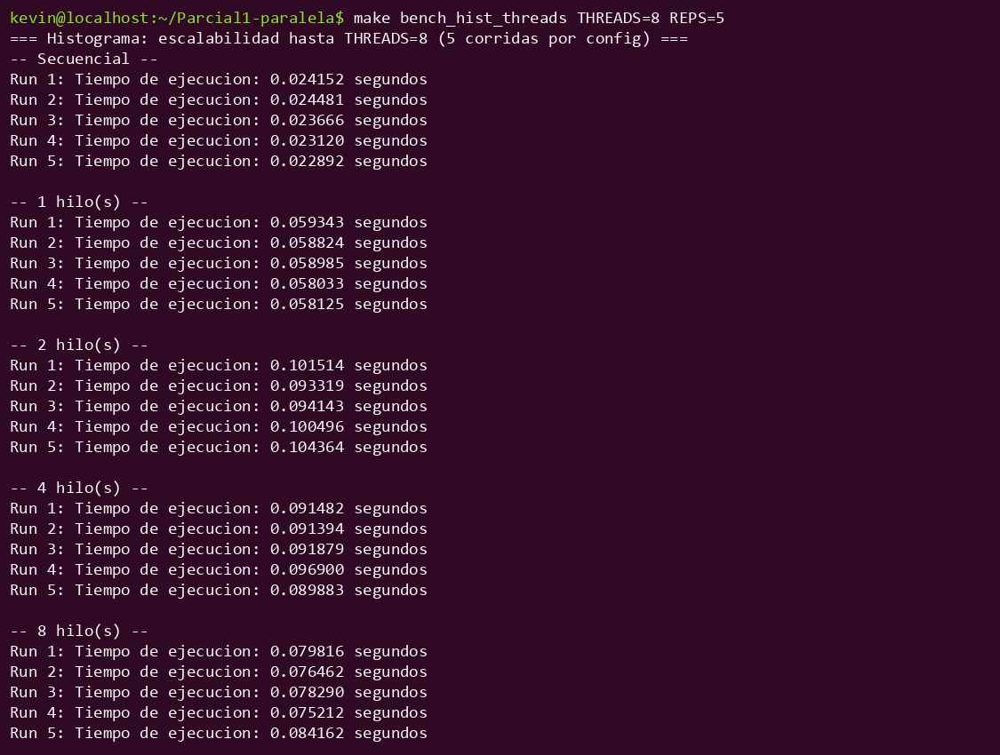
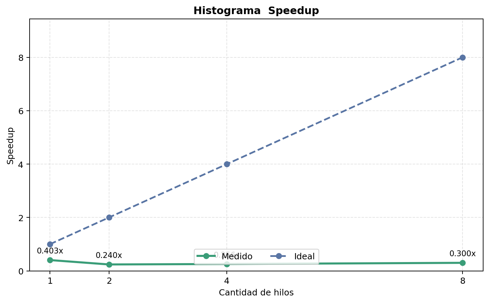
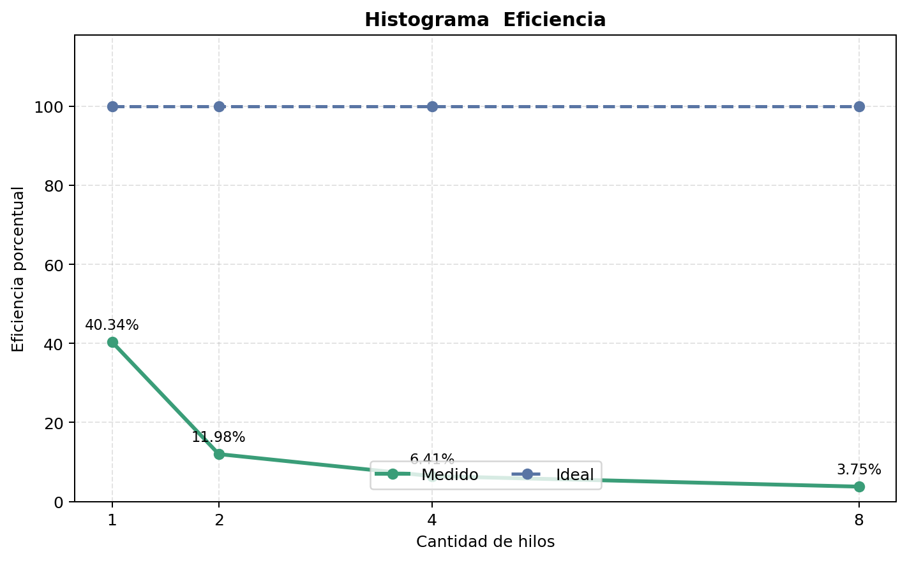
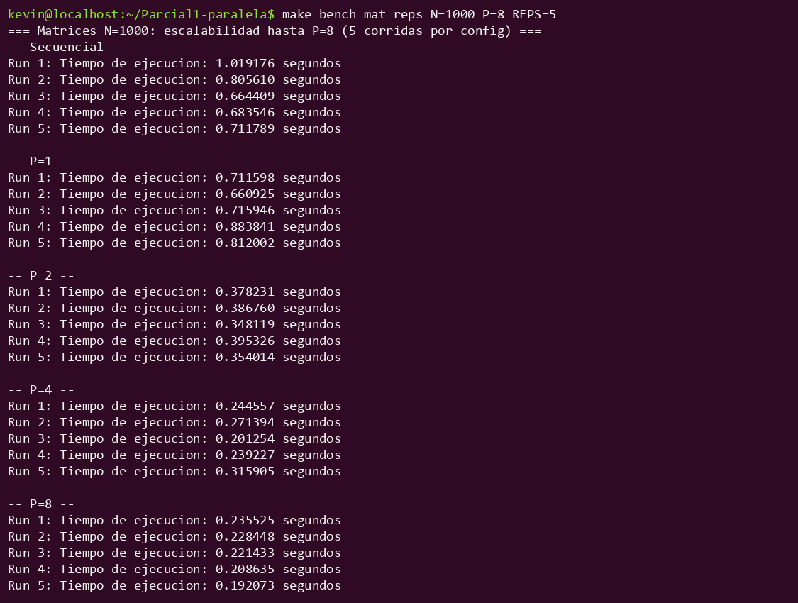
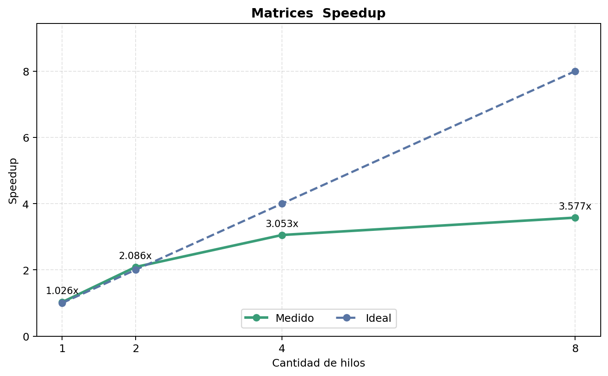
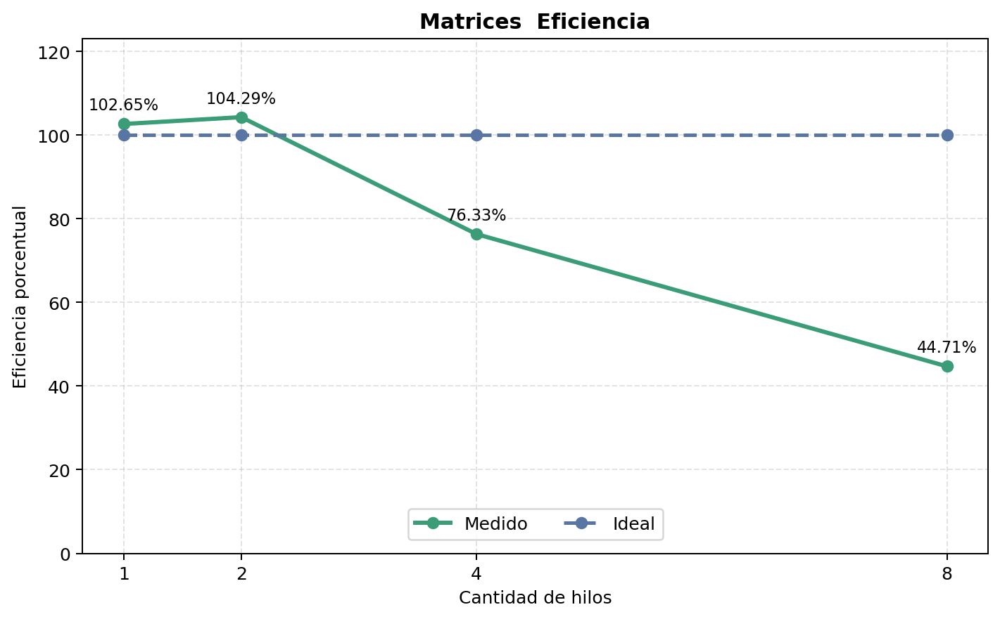

# Métricas de desempeño de Kevin Villagrán

Fecha de pruebas 2026-09-11

Máquina Laptop Windows con WSL Ubuntu

CPU 12th Gen Intel Core i7-12650H con 10 núcleos físicos y 16 hilos lógicos

RAM 15.7 GB

Sistema operativo Windows 11 Home

---

# Histograma

## Datos de prueba

- N de 10,000,000 elementos
- 100 bins
- Valores generados con `rand()` y semilla 42
- 5 corridas por cada cantidad de hilos
- Hilos probados 1, 2, 4 y 8

## Resultados

| Configuración | Tiempo promedio en segundos | Desv. estándar | Speedup | Eficiencia |
|---|---|---|---|---|
| Secuencial | 0.023662 | 0.000670 | Base | Base |
| Paralelo P=1 | 0.058662 | 0.000565 | 0.403x | 40.34% |
| Paralelo P=2 | 0.098767 | 0.004820 | 0.240x | 11.98% |
| Paralelo P=4 | 0.092308 | 0.002677 | 0.256x | 6.41% |
| Paralelo P=8 | 0.078788 | 0.003478 | 0.300x | 3.75% |

## Captura



## Speedup y eficiencia

Para cada punto se usó el tiempo promedio secuencial como base. El speedup se
calculó con `Ts / Tp`. La eficiencia se calculó con `speedup / P × 100`.

El secuencial tardó 0.023662 segundos en promedio. Con 8 hilos el paralelo
tardó 0.078788 segundos. El speedup fue 0.300x. El paralelo quedó más lento en
todas las cantidades de hilos medidas.

El segundo recorrido actualiza solo 100 bins compartidos. `atomic` cuida los
conteos. Varios hilos esperan cuando intentan sumar en el mismo bin. Por eso
el tiempo paralelo no mejora para este programa.





---

# Matrices

## Datos de prueba

- Matrices de 1000 × 1000
- 1,000,000 de elementos por matriz
- Datos `double` generados con `rand() % 10` y semilla 42
- 5 corridas por cada cantidad de trabajadores
- Trabajadores probados 1, 2, 4 y 8

## Resultados

| Configuración | Tiempo promedio en segundos | Desv. estándar | Speedup | Eficiencia |
|---|---|---|---|---|
| Secuencial | 0.776906 | 0.145886 | Base | Base |
| Paralelo P=1 | 0.756862 | 0.089570 | 1.026x | 102.65% |
| Paralelo P=2 | 0.372490 | 0.020575 | 2.086x | 104.29% |
| Paralelo P=4 | 0.254467 | 0.042495 | 3.053x | 76.33% |
| Paralelo P=8 | 0.217223 | 0.017212 | 3.577x | 44.71% |

## Captura



## Speedup y eficiencia

Para cada punto se usó el tiempo promedio secuencial como base. El speedup se
calculó con `Ts / Tp`. La eficiencia se calculó con
`speedup / P × 100`.

El secuencial tardó 0.776906 segundos en promedio. Con 8 trabajadores el
tiempo bajó a 0.217223 segundos. El speedup fue 3.577x. La curva medida sube
al aumentar trabajadores, pero queda debajo de la línea ideal.

Con 1 y 2 trabajadores la eficiencia medida pasó de 100 por ciento. Los
tiempos cambian entre corridas por tareas del sistema, frecuencia del
procesador y memoria. No significa que se aprovechó más de lo ideal.

Cada trabajador escribe filas diferentes de la matriz resultado. Eso permite
que el trabajo se reparta mejor que en el histograma. Con 8 trabajadores la
eficiencia baja porque comparten memoria y todos leen la matriz B.





El checksum fue 20258545518 en todas las configuraciones. Eso confirma que la
matriz resultado fue la misma.

---

# Comandos usados

```bash
make bench_hist_threads REPS=5
make bench_mat_reps N=1000 P=8 REPS=5
```
