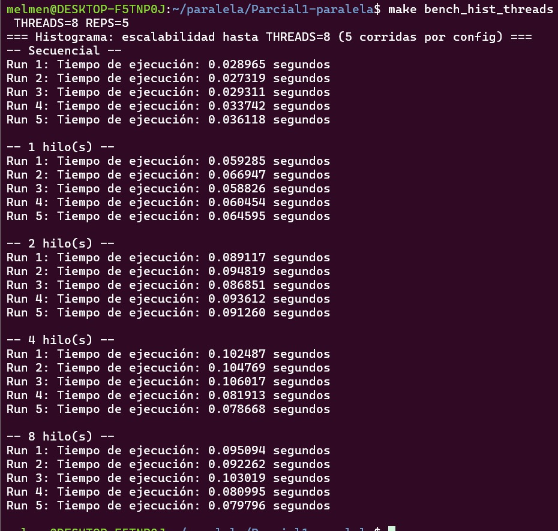
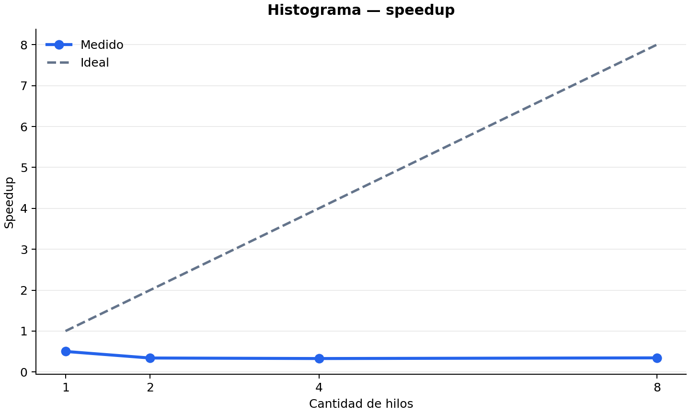
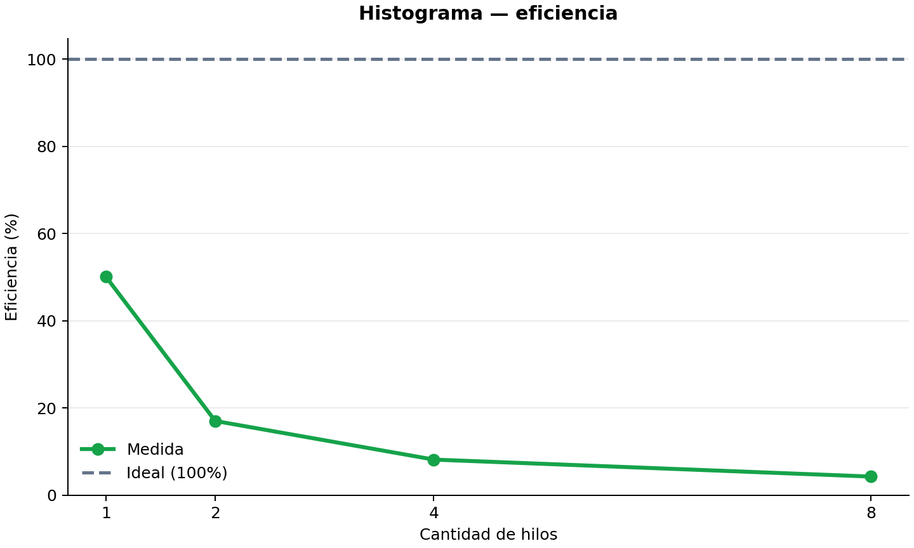
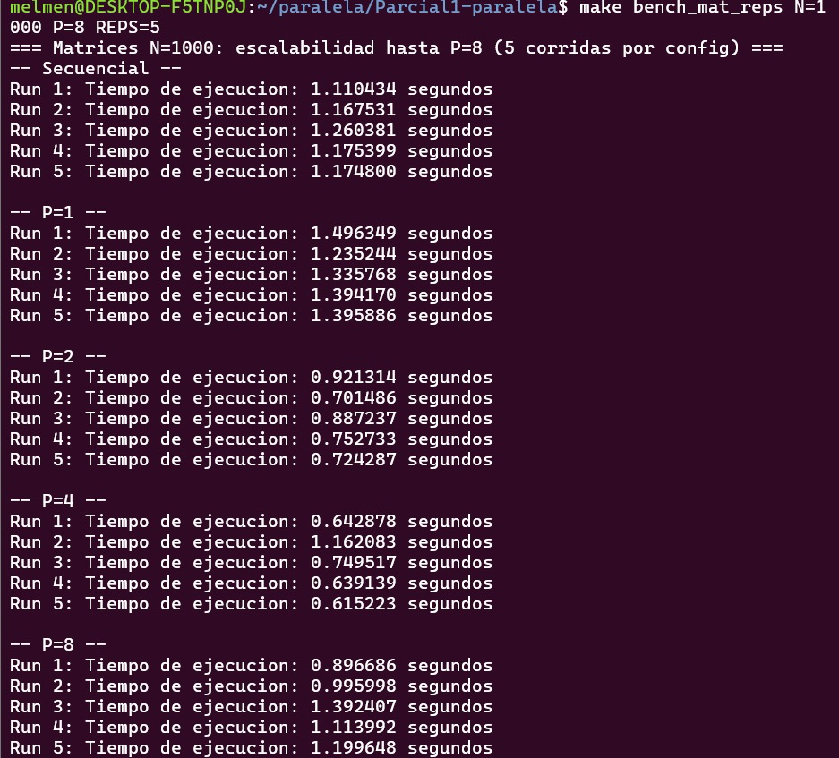
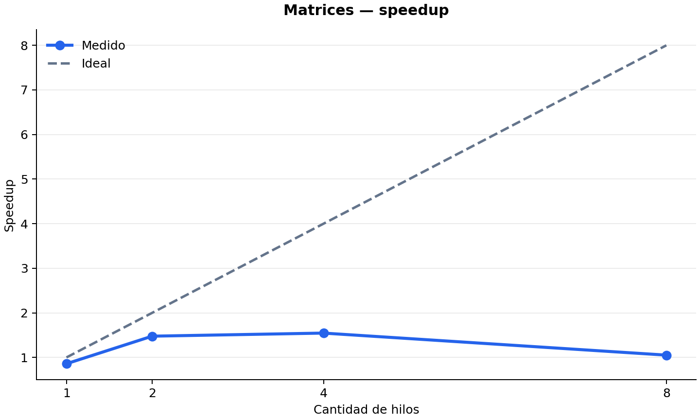
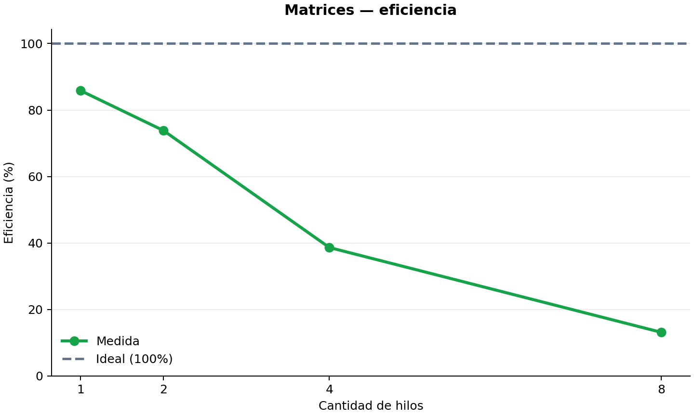

# Métricas de desempeño de Melisa Mendizabal

Fecha de pruebas 2026-09-11

Máquina DESKTOP-F5TNP0J

CPU 11th Gen Intel Core i7-11390H @ 3.40 GHz con 8 núcleos lógicos

RAM 12 GB

Sistema operativo Windows 11 Home con Ubuntu en WSL

---

# Histograma

## Datos de prueba

- N de 10,000,000 elementos
- 100 bins
- Valores generados con `rand()` y semilla 42
- 5 corridas por cada configuración
- Hilos probados 1, 2, 4 y 8

## Resultados

| Configuración | Tiempo promedio en segundos | Desv. estándar | Speedup | Eficiencia |
|---|---:|---:|---:|---:|
| Secuencial | 0.031091 | 0.003681 | Base | Base |
| Paralelo P=1 | 0.062021 | 0.003572 | 0.501x | 50.13% |
| Paralelo P=2 | 0.091132 | 0.003246 | 0.341x | 17.06% |
| Paralelo P=4 | 0.094771 | 0.013329 | 0.328x | 8.20% |
| Paralelo P=8 | 0.090233 | 0.009817 | 0.345x | 4.31% |

## Captura



## Speedup y eficiencia

Para cada punto se usó el tiempo promedio secuencial como base. El speedup se
calculó con `Ts / Tp`. La eficiencia se calculó con `speedup / P × 100`.

El secuencial tardó 0.031091 segundos en promedio. Con 8 hilos el paralelo
tardó 0.090233 segundos. El speedup fue 0.345x. El paralelo quedó más lento en
todas las cantidades de hilos medidas.

El histograma actualiza solo 100 bins compartidos. Los incrementos atómicos
protegen el conteo, pero generan contención cuando varios hilos escriben en el
mismo bin. Por eso el costo de coordinación supera el beneficio de repartir el
trabajo.





La suma de las frecuencias fue 10,000,000 en las corridas, por lo que se
clasificaron todos los elementos.

---

# Matrices

## Datos de prueba

- Matrices de 1000 × 1000
- 1,000,000 de elementos por matriz
- Datos `double` generados con `rand() % 10` y semilla 42
- 5 corridas por cada configuración
- Trabajadores probados 1, 2, 4 y 8

## Resultados

| Configuración | Tiempo promedio en segundos | Desv. estándar | Speedup | Eficiencia |
|---|---:|---:|---:|---:|
| Secuencial | 1.177709 | 0.053568 | Base | Base |
| Paralelo P=1 | 1.371483 | 0.095575 | 0.859x | 85.87% |
| Paralelo P=2 | 0.797411 | 0.099957 | 1.477x | 73.85% |
| Paralelo P=4 | 0.761768 | 0.229701 | 1.546x | 38.65% |
| Paralelo P=8 | 1.119746 | 0.190938 | 1.052x | 13.15% |

## Captura



## Speedup y eficiencia

Para cada punto se usó el tiempo promedio secuencial como base. El speedup se
calculó con `Ts / Tp`. La eficiencia se calculó con `speedup / P × 100`.

El mejor resultado fue P=4. El tiempo bajó de 1.177709 a 0.761768 segundos,
con speedup de 1.546x. Con 8 trabajadores aumentó a 1.119746 segundos: aún
fue apenas más rápido que el secuencial, pero la eficiencia cayó a 13.15%.

Cada trabajador calcula filas distintas de la matriz resultado, así que existe
ganancia real con 2 y 4 trabajadores. La caída después de P=4 se explica por
la sincronización, el ancho de banda de memoria compartido y la variación entre
corridas del sistema.





El checksum debe mantenerse igual entre configuraciones para validar que se
obtuvo la misma matriz resultado.

---

# Comandos usados

```bash
make bench_hist_threads THREADS=8 REPS=5
make bench_mat_reps N=1000 P=8 REPS=5
```
