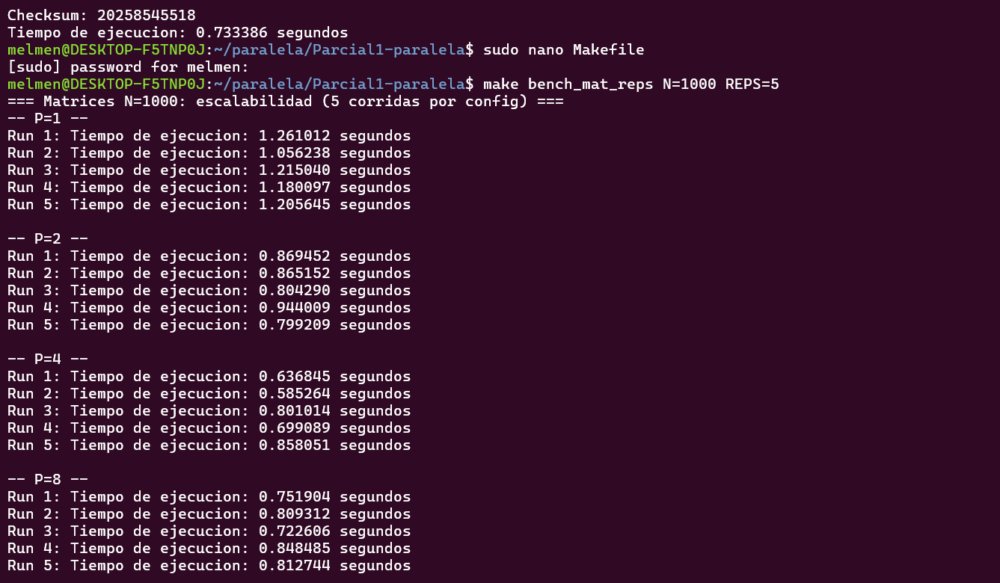
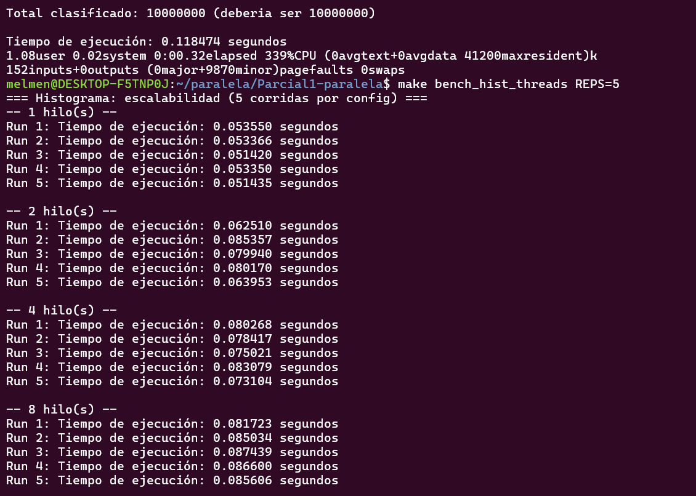

# Métricas de Desempeño - Histograma Masivo

**Estudiante:** Melisa Mendizabal
**Fecha de Pruebas:** 2026-09-11
**Máquina:** DESKTOP-F5TNP0J
**CPU:** 8 Nucleos, 11th Gen Intel(R) Core(TM) i7-11390H @ 3.40GHz (2.92 GHz)
**RAM:** 12 GB
**Sistema Operativo:** Windows 11 Home

---
# 1. Pruebas HISTOGRAMA

## Datos de Prueba

- **N (elementos):** 10,000,000
- **Número de bins:** 100
- **Generación:** rand() con seed=42
- **Baseline:** se usó el mismo binario paralelo con OMP_NUM_THREADS=1 como referencia secuencial (evita comparar entre dos binarios distintos)

---

## Resultados por número de hilos (5 corridas c/u)

| Hilos | Tiempo promedio (s) | Desv. estándar (s) | Mínimo (s) | Máximo (s) | Speedup | Eficiencia |
|-------|---------------------|---------------------|------------|------------|---------|------------|
| 1     | 0.052624            | 0.001095            | 0.051420   | 0.053550   | 1.00x   | 100.0%     |
| 2     | 0.074386            | 0.010423            | 0.062510   | 0.085357   | 0.71x   | 35.4%      |
| 4     | 0.077978            | 0.003999            | 0.073104   | 0.083079   | 0.67x   | 16.9%      |
| 8     | 0.085280            | 0.002192            | 0.081723   | 0.087439   | 0.62x   | 7.7%       |

### Detalles de ejecuciones

```
1 hilo:  0.053550  0.053366  0.051420  0.053350  0.051435
2 hilos: 0.062510  0.085357  0.079940  0.080170  0.063953
4 hilos: 0.080268  0.078417  0.075021  0.083079  0.073104
8 hilos: 0.081723  0.085034  0.087439  0.086600  0.085606
```
### Prueba de ejecución

---
---

## Análisis y Conclusiones

En mi máquina, agregar hilos nunca superó la versión de 1 hilo: el speedup baja de 1.00x a 0.62x conforme aumentan los hilos, y la eficiencia cae de 100% a 7.7% con 8 hilos.

Esto confirma lo que ya documentó Anggie: para N=10,000,000 el overhead de crear/destruir hilos y la contención del #pragma omp atomic en histograma[indice]++ pesan más que el trabajo real por hilo. Cada hilo hace muy poco trabajo (100 bins compartidos, incrementos atómicos constantes), así que en vez de repartir carga, los hilos terminan esperándose unos a otros para escribir en el histograma.
Esto no es un error de implementación, ya que la paralelización con reduction() y atomic es correcta, sino un ejemplo de que este problema, con este tamaño de N, no es rentable de paralelizar de forma ingenua.

---

## Validación de Corrección
Total clasificado: 10,000,000 en todas las corridas
Histograma idéntico entre 1, 2, 4 y 8 hilos


# 2. Pruebas MATRICES

## Datos de Prueba
 
- **N (dimensión de las matrices):** 1000 x 1000
- **Generación:** rand() % 10 con seed=42
- **Baseline:** se usó el mismo binario matrices_paralelo con P=1 como referencia secuencial (mismo criterio que usó Kevin, para comparar con el mismo compilador y banderas de optimización)
---
 
## Resultados por número de trabajadores (5 corridas c/u)
 
| P | Tiempo promedio (s) | Desv. estándar (s) | Mínimo (s) | Máximo (s) | Speedup | Eficiencia |
|---|----------------------|---------------------|------------|------------|---------|------------|
| 1 | 1.183606             | 0.076975            | 1.056238   | 1.261012   | 1.00x   | 100.0%     |
| 2 | 0.856422             | 0.058967            | 0.799209   | 0.944009   | 1.38x   | 69.1%      |
| 4 | 0.716053             | 0.112970            | 0.585264   | 0.858051   | 1.65x   | 41.3%      |
| 8 | 0.789010             | 0.050742            | 0.722606   | 0.848485   | 1.50x   | 18.8%      |
 
### Detalles de ejecuciones
 
```
P=1: 1.261012  1.056238  1.215040  1.180097  1.205645
P=2: 0.869452  0.865152  0.804290  0.944009  0.799209
P=4: 0.636845  0.585264  0.801014  0.699089  0.858051
P=8: 0.751904  0.809312  0.722606  0.848485  0.812744
```
### Prueba de ejecución

---
 
## Análisis y Conclusiones
 
En mi máquina el mejor punto es P=4 (speedup 1.65x, eficiencia 41.3%). Con P=8 el tiempo promedio empeora respecto a P=4 (0.789s vs 0.716s) y la eficiencia cae a solo 18.8%, lo que indica que a partir de 4 trabajadores el overhead de crear/sincronizar hilos y la posible saturación del ancho de banda de memoria (acceso a matrizB[k*n+j] por columnas) empiezan a pesar más que el trabajo adicional repartido.
 
A diferencia del histograma, aquí sí hay una ganancia real: incluso con P=8 el tiempo sigue siendo menor que con P=1, así que la paralelización sí vale la pena para este problema, aunque no escale de forma lineal. La granularidad es gruesa (cada fila tiene N multiplicaciones independientes) y no hay condiciones de carrera, pero el rendimiento está limitado por el hardware (núcleos disponibles y memoria), no por la estrategia de paralelización.
 
---
 
## Validación de Corrección
 
Resultado de la matriz C consistente entre las corridas con distinto P (validar con el checksum que imprime el programa)